# Домашнее задание к занятию «Хранение в K8s»

### Примерное время выполнения задания — 180 минут

### Цель задания

Научиться работать с хранилищами в тестовой среде Kubernetes:
- обеспечить обмен файлами между контейнерами пода;
- создавать **PersistentVolume** (PV) и использовать его в подах через **PersistentVolumeClaim** (PVC);
- объявлять свой **StorageClass** (SC) и монтировать его в под через **PVC**.

Это задание поможет вам освоить базовые принципы взаимодействия с хранилищами в Kubernetes — одного из ключевых навыков для работы с кластерами. На практике Volume, PV, PVC используются для хранения данных независимо от пода, обмена данными между подами и контейнерами внутри пода. Понимание этих механизмов поможет вам упростить проектирование слоя данных для приложений, разворачиваемых в кластере k8s.

------

## **Подготовка**
### **Чеклист готовности**

1. Установленное K8s-решение (допустим, MicroK8S).
2. Установленный локальный kubectl.
3. Редактор YAML-файлов с подключенным GitHub-репозиторием.

------

### Инструменты, которые пригодятся для выполнения задания

1. [Инструкция](https://microk8s.io/docs/getting-started) по установке MicroK8S.
2. [Инструкция](https://minikube.sigs.k8s.io/docs/start/?arch=%2Fwindows%2Fx86-64%2Fstable%2F.exe+download) по установке Minikube. 
3. [Инструкция](https://kubernetes.io/docs/tasks/tools/install-kubectl-windows/) по установке kubectl.
4. [Инструкция](https://marketplace.visualstudio.com/items?itemName=ms-kubernetes-tools.vscode-kubernetes-tools) по установке VS Code

### Дополнительные материалы, которые пригодятся для выполнения задания
1. [Описание Volumes](https://kubernetes.io/docs/concepts/storage/volumes/).
2. [Описание Ephemeral Volumes](https://kubernetes.io/docs/concepts/storage/volumes/).
3. [Описание PersistentVolume](https://kubernetes.io/docs/concepts/storage/persistent-volumes/).
4. [Описание PersistentVolumeClaim](https://kubernetes.io/docs/concepts/storage/persistent-volumes/#persistentvolumeclaims).
5. [Описание StorageClass](https://kubernetes.io/docs/concepts/storage/storage-classes/).
6. [Описание Multitool](https://github.com/wbitt/Network-MultiTool).

------

## Задание 1. Volume: обмен данными между контейнерами в поде
### Задача

Создать Deployment приложения, состоящего из двух контейнеров, обменивающихся данными.

### Шаги выполнения
>1. Создать Deployment приложения, состоящего из контейнеров busybox и multitool.
>2. Настроить busybox на запись данных каждые 5 секунд в некий файл в общей директории.
>3. Обеспечить возможность чтения файла контейнером multitool.

### Что сдать на проверку
>- Манифесты:
>  - `containers-data-exchange.yaml`
>- Скриншоты:
>  - описание пода с контейнерами (`kubectl describe pods data-exchange`)
>  - вывод команды чтения файла (`tail -f <имя общего файла>`)

------

## Решение

[containers-data-exchange.yaml](./infra/task_1/containers-data-exchange.yaml)

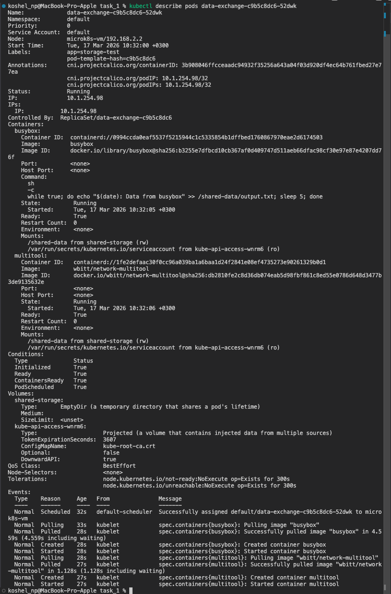
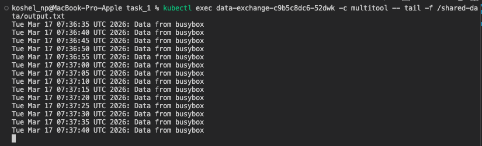

------

## Задание 2. PV, PVC
### Задача
>Создать Deployment приложения, использующего локальный PV, созданный вручную.

### Шаги выполнения
>1. Создать Deployment приложения, состоящего из контейнеров busybox и multitool, использующего созданный ранее PVC
>2. Создать PV и PVC для подключения папки на локальной ноде, которая будет использована в поде.
>3. Продемонстрировать, что контейнер multitool может читать данные из файла в смонтированной директории, в который busybox записывает данные каждые 5 секунд. 
>4. Удалить Deployment и PVC. Продемонстрировать, что после этого произошло с PV. Пояснить, почему. (Используйте команду `kubectl describe pv`).
>5. Продемонстрировать, что файл сохранился на локальном диске ноды. Удалить PV.  Продемонстрировать, что произошло с файлом после удаления PV. Пояснить, почему.

### Что сдать на проверку
>- Манифесты:
>  - `pv-pvc.yaml`
>- Скриншоты:
>  - каждый шаг выполнения задания, начиная с шага 2.
>- Описания:
>  - объяснение наблюдаемого поведения ресурсов в двух последних шагах.

------

## Решение

- Приминили манифест [pv-pvc.yaml]( ./infra/task_2/pv-pvc.yaml)   
- Проверяем чтение: 

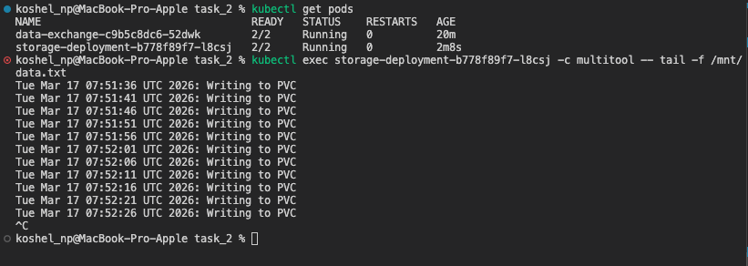
- Удаляем ресурсы:

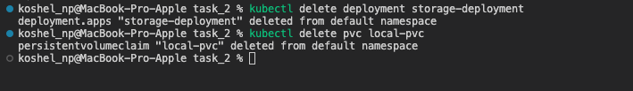
- Информация и текущее состояние тома (статус Released ):

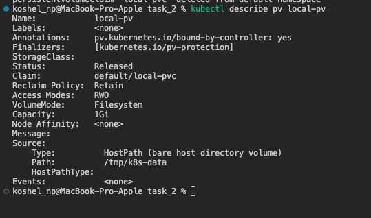    
- Файл на ноде 

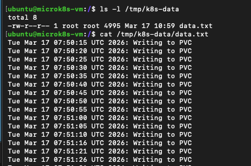
- Удаляем PV    

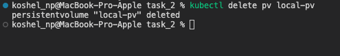
- Проверяем наличие файла:  

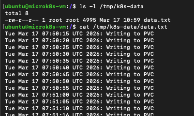

После удаления Deployment и PVC, статус PV изменится на Released.   
Мы установили persistentVolumeReclaimPolicy: Retain. Это означает, что при удалении PVC сам PV не удаляется автоматически, а переходит в режим "освобожден", чтобы администратор мог вручную обработать данные. PV нельзя переиспользовать для нового PVC, пока он не будет очищен и пересоздан.    
После удаления самого объекта PV из кластера, файл по пути /tmp/k8s-data/data.txt останется на месте на локальном диске узла.   
Это происходит потому, что тип тома hostPath привязан к конкретной директории файловой системы хоста. Kubernetes управляет объектом PV в кластере, но не берет на себя ответственность за удаление данных в произвольных папках на физическом диске узла при удалении манифеста PV.

------

## Задание 3. StorageClass
### Задача
>Создать Deployment приложения, использующего PVC, созданный на основе StorageClass.

### Шаги выполнения

>1. Создать Deployment приложения, состоящего из контейнеров busybox и multitool, использующего созданный ранее PVC.
>2. Создать SC и PVC для подключения папки на локальной ноде, которая будет использована в поде.
>3. Продемонстрировать, что контейнер multitool может читать данные из файла в смонтированной директории, в который busybox записывает данные каждые 5 секунд.

### Что сдать на проверку
>- Манифесты:
>  - `sc.yaml`
>- Скриншоты:
>  - каждый шаг выполнения задания, начиная с шага 2
---

## Решение

[Манифест sc.yaml](./infra/task_3/sc.yaml)

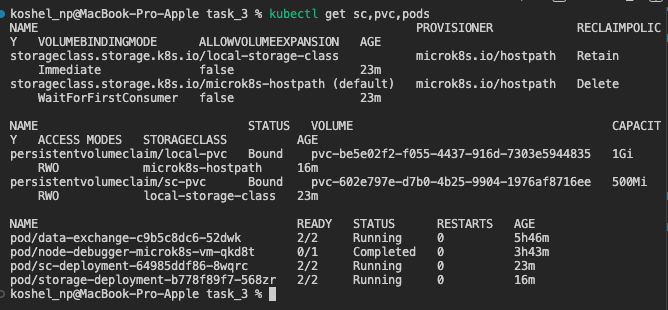

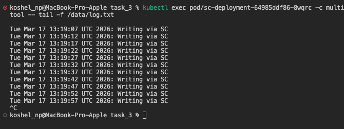

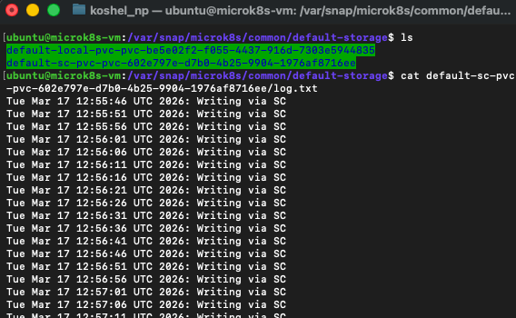

---

## **Правила приёма работы**
1. Домашняя работа оформляется в своём Git-репозитории в файле README.md. Выполненное домашнее задание пришлите ссылкой на .md-файл в вашем репозитории.
2. Файл README.md должен содержать скриншоты вывода необходимых команд `kubectl`, скриншоты результатов, пояснения.
3. Репозиторий должен содержать тексты манифестов или ссылки на них в файле README.md.

## **Критерии оценивания задания**
1. Зачёт: Все задачи выполнены, манифесты корректны, есть доказательства работы (скриншоты) и пояснения по заданию 2.
2. Доработка (на доработку задание направляется 1 раз): основные задачи выполнены, при этом есть ошибки в манифестах или отсутствуют проверочные скриншоты.
3. Незачёт: работа выполнена не в полном объёме, есть ошибки в манифестах, отсутствуют проверочные скриншоты. Все попытки доработки израсходованы (на доработку работа направляется 1 раз). Этот вид оценки используется крайне редко.

## **Срок выполнения задания**  
1. 5 дней на выполнение задания.
2. 5 дней на доработку задания (в случае направления задания на доработку).
