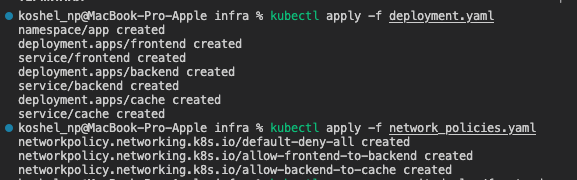
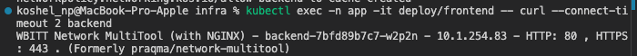
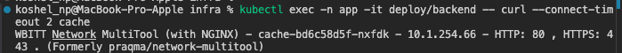
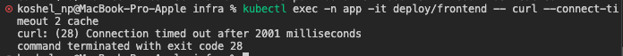
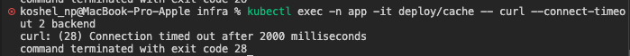
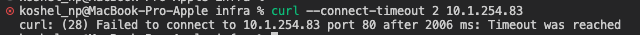

# Домашнее задание к занятию «Как работает сеть в K8s»

### Цель задания

Настроить сетевую политику доступа к подам.

### Чеклист готовности к домашнему заданию

1. Кластер K8s с установленным сетевым плагином Calico.

### Инструменты и дополнительные материалы, которые пригодятся для выполнения задания

1. [Документация Calico](https://www.tigera.io/project-calico/).
2. [Network Policy](https://kubernetes.io/docs/concepts/services-networking/network-policies/).
3. [About Network Policy](https://docs.projectcalico.org/about/about-network-policy).

-----

### Задание 1. Создать сетевую политику или несколько политик для обеспечения доступа

> 1. Создать deployment'ы приложений frontend, backend и cache и соответсвующие сервисы.
> 2. В качестве образа использовать network-multitool.
> 3. Разместить поды в namespace App.
> 4. Создать политики, чтобы обеспечить доступ frontend -> backend -> cache. Другие виды подключений должны быть запрещены.
> 5. Продемонстрировать, что трафик разрешён и запрещён.

### Правила приёма работы

> 1. Домашняя работа оформляется в своём Git-репозитории в файле README.md. Выполненное домашнее задание пришлите ссылкой на .md-файл в вашем репозитории.
> 2. Файл README.md должен содержать скриншоты вывода необходимых команд, а также скриншоты результатов.
> 3. Репозиторий должен содержать тексты манифестов или ссылки на них в файле README.md.

## Решение

[Манифесты](./infra/)

Проверка доступа

Разрешенные соединения:

   1. Из frontend в backend:
   kubectl exec -n app -it deploy/frontend -- curl --connect-timeout 2 backend (Успех)
   

   2. Из backend в cache:
   kubectl exec -n app -it deploy/backend -- curl --connect-timeout 2 cache (Успех)
   

Запрещенные соединения:

   1. Из frontend напрямую в cache:
   kubectl exec -n app -it deploy/frontend -- curl --connect-timeout 2 cache (Тайм-аут)
  
   2. Из cache в backend:
   kubectl exec -n app -it deploy/cache -- curl --connect-timeout 2 backend (Тайм-аут)
   
   3. Извне в любой под:
   Трафик будет блокироваться политикой default-deny-all.
   

-----