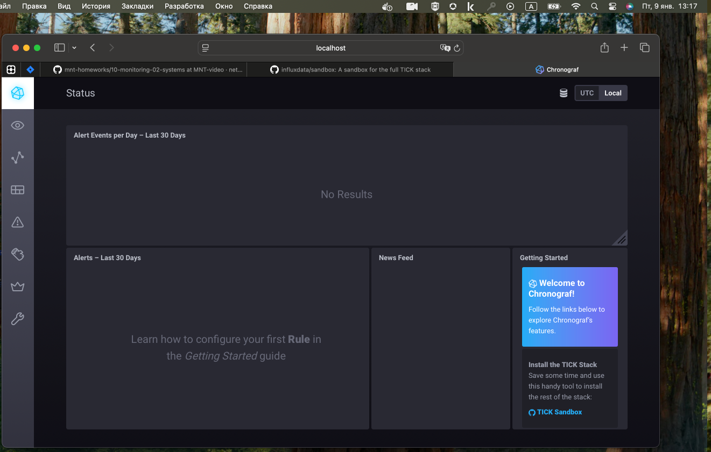
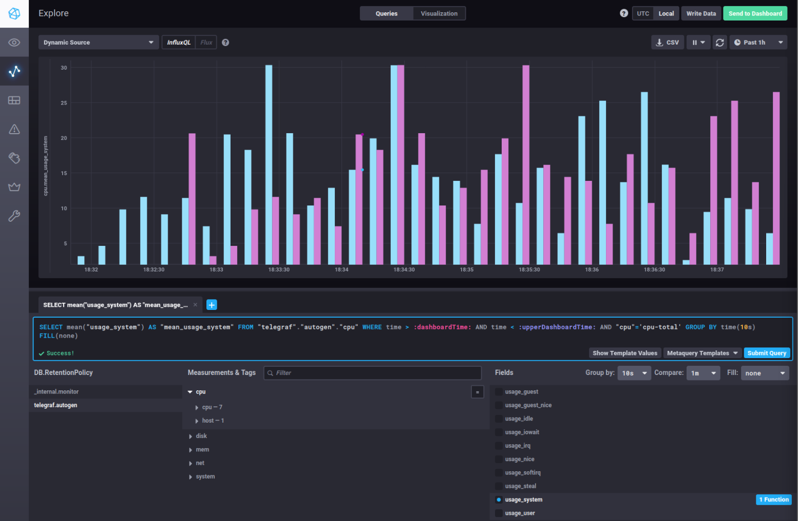
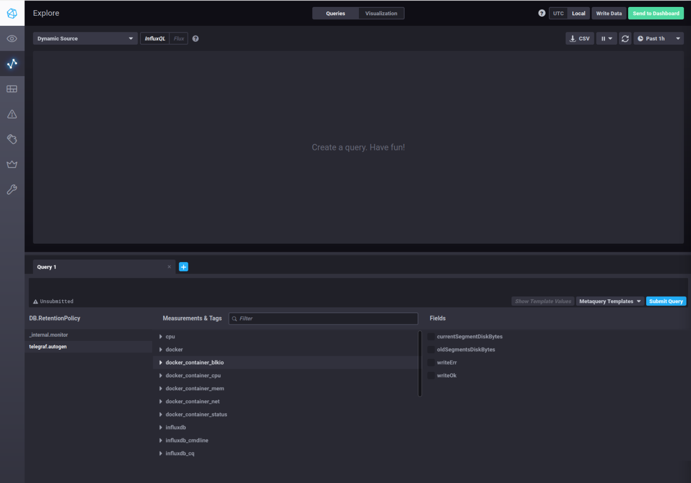

# Домашнее задание к занятию "13.Системы мониторинга"

## Обязательные задания

1. Вас пригласили настроить мониторинг на проект. На онбординге вам рассказали, что проект представляет из себя 
платформу для вычислений с выдачей текстовых отчетов, которые сохраняются на диск. Взаимодействие с платформой 
осуществляется по протоколу http. Также вам отметили, что вычисления загружают ЦПУ. Какой минимальный набор метрик вы
выведите в мониторинг и почему?

## Решение
---
Использовал подход SRE основываясь на основных его тезисах, так как он разработан на основе опыта инженеров.
Метрики:
* CPU Usage / Load Average (на онбординге подсветили что вычисление загружают ЦПУ и нужно вовремя среагировать для увеличение ЦПУ или решения проблем с ПО) ..CPU Throttling(если используются контейнеры, чтобы среда не ограничевала выполнение задач )
* Disk I/O & Disk Space Usage & (текстовые отчеты хранятся на диске и нужно отслеживать свободное место, скорость и задержки при чтение/записи на диск так как когда место будет заканчивать скорость будет падать или другие пробленмы с инфраструктурой или приложением и можно решить вопрос до возникновения проблемы)
* Memory Usage Нагрузка на ЦПУ сопровождается ростом потребления памяти, нужно избегать замедления из-за использованиея swap
* Доступность сервиса Request Rate & Error Rate & Latency (так как сервис работатет по http нужно следить за доступность ПО для клиента)
Использование данного набра позволит нам знать работате сервис, хватает ему ресурсов, как быстро отрабатывает ПО и когда мы столкнемся в нехватке ресурсов.
---
#
2. Менеджер продукта посмотрев на ваши метрики сказал, что ему непонятно что такое RAM/inodes/CPUla. Также он сказал, 
что хочет понимать, насколько мы выполняем свои обязанности перед клиентами и какое качество обслуживания. Что вы 
можете ему предложить?

## Решение
---
Необходимо перевести техничекские показатели в SLI & SLO
Убрать технические показатели из дашборда для менеджера или дать пояснения к ним если он хочет их видеть.
Метрики:
* Доступность (Процент успешных ответов сервиса. если сервис не доступен или падает в моент работы показатель снижается и мы нарущаем обязательства, обговорить с бизнесом целевой показатель например 99,9% - 43 минут простоя в меся )
* Своевременность уведомления о проблемах
* Время отклика и вычислений
* Объём обработанных запросов
* Внедрить общий SLA

Благодаря внедрению данных метрик мы сможем сказать % времени, когда сервис соответствовал SLA (время отклика, доступность, успешность).
Эти показатели напрямую отражают качество обслуживания клиентов.

---
#
3. Вашей DevOps команде в этом году не выделили финансирование на построение системы сбора логов. Разработчики в свою 
очередь хотят видеть все ошибки, которые выдают их приложения. Какое решение вы можете предпринять в этой ситуации, 
чтобы разработчики получали ошибки приложения?

## Решение
---
Можно придумать несколько вариантов одни из них:
Настроить отправку логов на единый сервер или шару через syslog/journald
Разработчики сохраняют логи в директории и напилят легкий интерфейс для просмотра и поиска по файлам
Дать ограниченный доступ разработчикам в директорию на сервере с логами

---

#
4. Вы, как опытный SRE, сделали мониторинг, куда вывели отображения выполнения SLA=99% по http кодам ответов. 
Вычисляете этот параметр по следующей формуле: summ_2xx_requests/summ_all_requests. Данный параметр не поднимается выше 
70%, но при этом в вашей системе нет кодов ответа 5xx и 4xx. Где у вас ошибка?

## Решение
---
Не учитываем 3хх
В summ_all_requests не учтены все запросы
Ошибки в агрегации метрик
Решение:
summ_2xx_requests+summ_3xx_requests/summ_all_requests
Проверить источники и правильность расчетов


---
#
5. Опишите основные плюсы и минусы pull и push систем мониторинга.

## Решение
---
Pull-модель (Система сама забирает данные)
+Простота развёртывания на стороне агента Контроль нагрузки Централизованный Service Discovery Обнаружение отказа Простая отладка Безопасность
-Сложность работы за NAT/Firewall Проблемы с Short-lived задачами Нагрузка на целевые системы Ограниченная масштабируемость
Push-модель (Приложения сами отправляют данные)
+Минимальная нагрузка на целевые системы Низкая задержка Масштабируемость Проще проходить через Firewall
-DoS-атаки Сложнее понять статус сервиса Настройка на стороне приложения

Pull‑модель лучше подходит для:
* долгосрочных сервисов;
* динамических сред;
* где важен контроль и прозрачность конфигурации.

Push‑модель предпочтительнее для:
* краткосрочных задач;
* сред с жёсткими сетевыми ограничениями;
* где нужно агрегировать данные перед отправкой.

---
#
6. Какие из ниже перечисленных систем относятся к push модели, а какие к pull? А может есть гибридные?

    - Prometheus 
    - TICK
    - Zabbix
    - VictoriaMetrics
    - Nagios

## Решение
---
    - Prometheus  Pull (с элементами Push) гибридность за счет Pushgateway
    - TICK Push
    - Zabbix Гибрид основная pull (возможно переключиться на Push) Agent (Passive): Pull Agent (Active): Push Trapper: Push 
    - VictoriaMetrics Гибрид по умолчанию Push
    - Nagios Pull

---
#
7. Склонируйте себе [репозиторий](https://github.com/influxdata/sandbox/tree/master) и запустите TICK-стэк, 
используя технологии docker и docker-compose.

В виде решения на это упражнение приведите скриншот веб-интерфейса ПО chronograf (`http://localhost:8888`). 

P.S.: если при запуске некоторые контейнеры будут падать с ошибкой - проставьте им режим `Z`, например
`./data:/var/lib:Z`
## Решение
---

---
#
8. Перейдите в веб-интерфейс Chronograf (http://localhost:8888) и откройте вкладку Data explorer.
        
    - Нажмите на кнопку Add a query
    - Изучите вывод интерфейса и выберите БД telegraf.autogen
    - В `measurments` выберите cpu->host->telegraf-getting-started, а в `fields` выберите usage_system. Внизу появится график утилизации cpu.
    - Вверху вы можете увидеть запрос, аналогичный SQL-синтаксису. Поэкспериментируйте с запросом, попробуйте изменить группировку и интервал наблюдений.

Для выполнения задания приведите скриншот с отображением метрик утилизации cpu из веб-интерфейса.
## Решение
---

---
#
9. Изучите список [telegraf inputs](https://github.com/influxdata/telegraf/tree/master/plugins/inputs). 
Добавьте в конфигурацию telegraf следующий плагин - [docker](https://github.com/influxdata/telegraf/tree/master/plugins/inputs/docker):
```
[[inputs.docker]]
  endpoint = "unix:///var/run/docker.sock"
```

Дополнительно вам может потребоваться донастройка контейнера telegraf в `docker-compose.yml` дополнительного volume и 
режима privileged:
```
  telegraf:
    image: telegraf:1.4.0
    privileged: true
    volumes:
      - ./etc/telegraf.conf:/etc/telegraf/telegraf.conf:Z
      - /var/run/docker.sock:/var/run/docker.sock:Z
    links:
      - influxdb
    ports:
      - "8092:8092/udp"
      - "8094:8094"
      - "8125:8125/udp"
```

После настройке перезапустите telegraf, обновите веб интерфейс и приведите скриншотом список `measurments` в 
веб-интерфейсе базы telegraf.autogen . Там должны появиться метрики, связанные с docker.

Факультативно можете изучить какие метрики собирает telegraf после выполнения данного задания.

## Решение
---

---

### Как оформить ДЗ?

Выполненное домашнее задание пришлите ссылкой на .md-файл в вашем репозитории.

---

